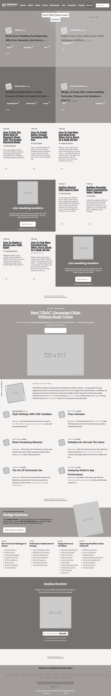

# Smashing Magazine

> This project is based on Smashing Magazine Web page and is made for educational purposes [Smashing Magazine](https://www.smashingmagazine.com/)

This web page is developed by HTML5 and CSS only, without using any framework or library.

## Built With

- HTML5
- CSS
- Stylelint and stickler for linting purpose
- html-validator-cli for validate HTML

## Live Demo

-  Coming soon

## Getting Started

**Install on Your Own Machine.**
**You can skip the linter and HTML validators setup if you don't want to validate the code.**

Set up your machine.

### Prerequisites

  > All the prerequisites are optional.

- Git
- HTML validator
- CSS Linter

### Setup

- Follow the link below to install git
  > [download git](https://git-scm.com/downloads)
- Follow the link below to set up an HTML validator
  > [Set up HTML validator](https://github.com/microverseinc/linters-config/tree/master/html_validator)
- Follow the link below to set up a linter
  > [Set up CSS Linter to check code errors](https://github.com/microverseinc/linters-config/tree/master/css#troubleshooting)
- Clone the repository
  > Clone the repository by run the code below on your computer terminal.
  `git clone https://github.com/balerum03/smashing-heatmap.git `

### Install

*Optional*
Go to the project directory on your terminal and run `npm install` to install the HTML validator and CSS linter.

### Usage

Go to the project directory and run open the `index.html` file on your browser.

## Authors

👤 **Abdulaziz Ali**

- Github: [@abredi](https://github.com/abredi)
- Twitter: [@rediabdulaziz](https://twitter.com/rediabdulaziz)
- Linkedin: [linkedin](https://www.linkedin.com/in/abdulaziz-ali-98948011a)

👤 **Adan Fernandez Bonilla**

- Github: [@balerum03](https://github.com/balerum03)
- Twitter: [@balerum03](https://twitter.com/balerum03)
- Linkedin: [linkedin](https://www.linkedin.com/in/adan-fernandez-bonilla-4560831a5/)

## 🤝 Contributing

Contributions, issues and feature requests are welcome!

Feel free to check the [issues page](https://github.com/balerum03/smashing-heatmap/issues).

## Show your support

Give a ⭐️ if you like this project!

## Acknowledgments

- [Thanks to Microverse](https://github.com/microverseinc)

## 📝 License

This project is [MIT](LICENSE) licensed.
